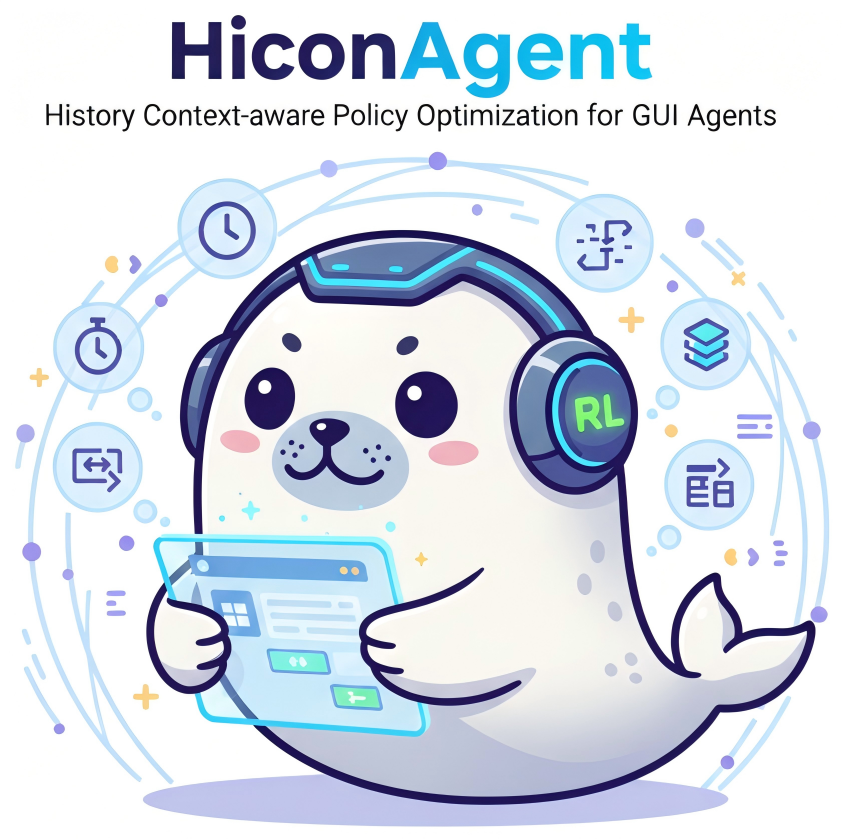
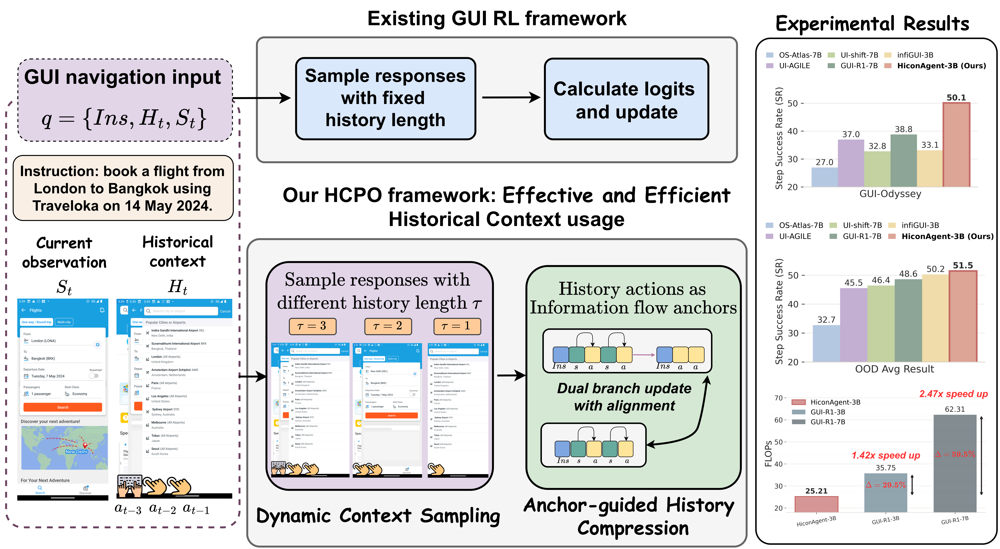
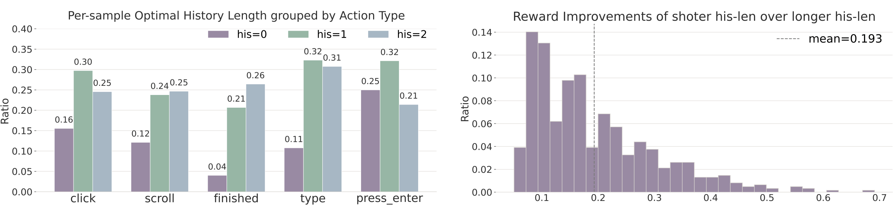
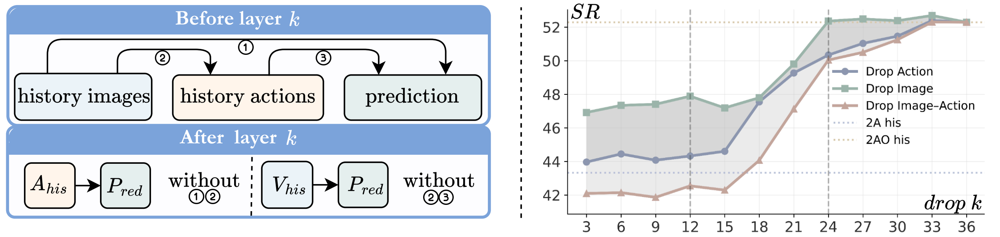
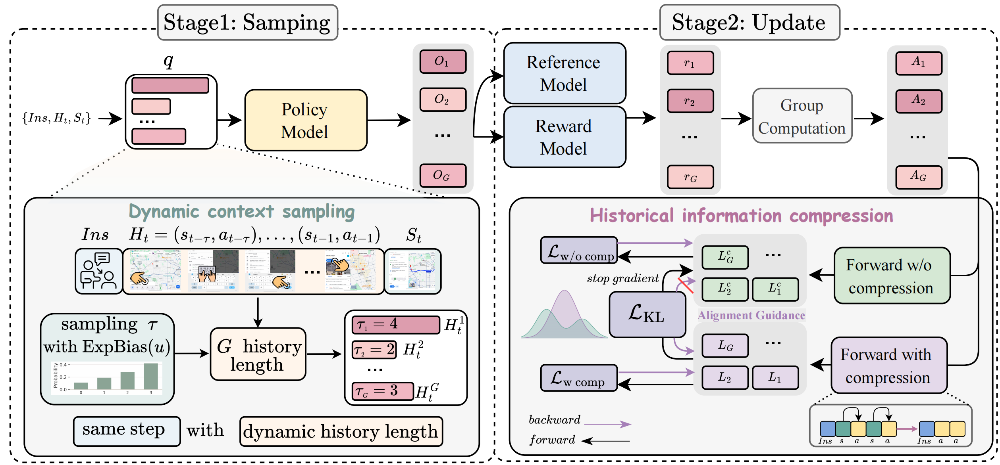
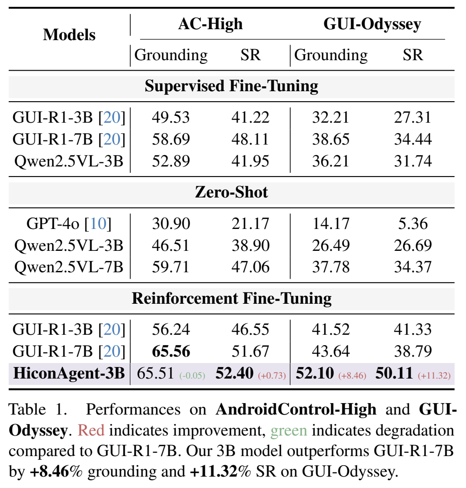
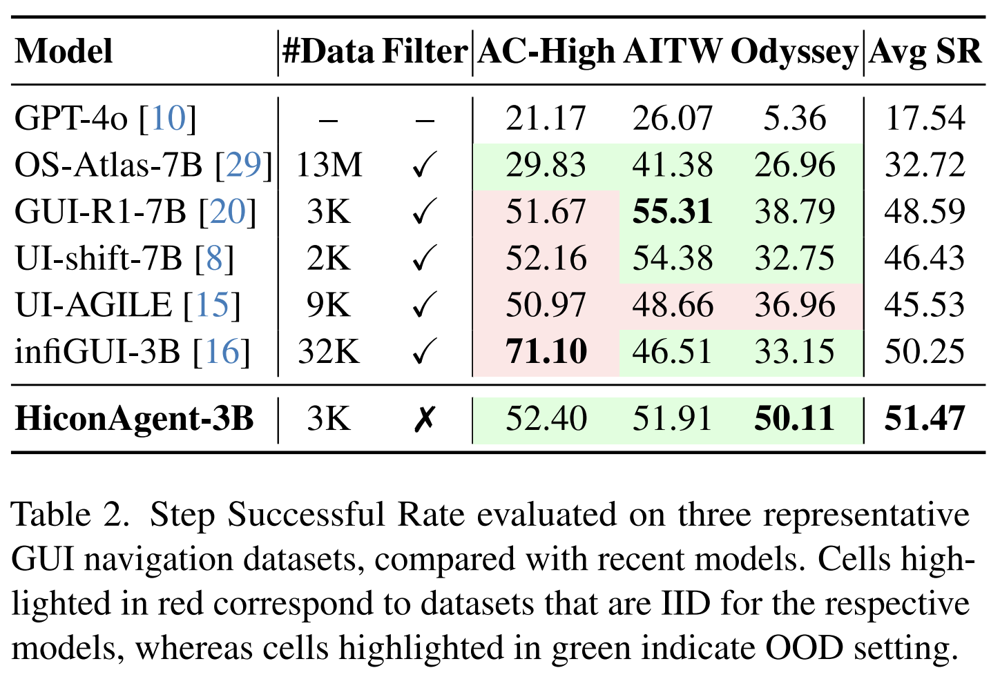

<div align="center">

<h2>
  
  <b><b>HiconAgent: History Context-aware Policy Optimization for GUI Agents</b></b>
</h2>

<p>
<a>Xurui Zhou</a><sup>1</sup>,
<a href="https://scholar.google.com/citations?user=Mpg0w3cAAAAJ">Gongwei Chen</a><sup>1</sup>,
<a>Yuquan Xie</a><sup>1</sup>,
<a href="https://scholar.google.com/citations?user=TDBF2UoAAAAJ">Zaijing Li</a><sup>1</sup>,
<a href="https://jnhujnhu.github.io/">Kaiwen Zhou</a><sup>2</sup>,
<br>
<a>Shuai Wang</a><sup>2</sup>,
<a href="https://shuoyang-1998.github.io/">Shuo Yang</a><sup>1</sup>,
<a href="https://scholar.google.com/citations?user=mEjhz-IAAAAJ">Zhuotao Tian</a><sup>1</sup>,
<a href="https://scholar.google.com/citations?user=9Vc--XsAAAAJ">Rui Shao</a><sup>1</sup>
<sup>&#9993;</sup>
</p>

<p>
<sup>1</sup> Harbin Institute of Technology, Shenzhen &nbsp;&nbsp;&nbsp;
<sup>2</sup> Huawei Noah’s Ark Lab
</p>

<p><sup>&#9993;</sup> Corresponding author</p>

[](https://arxiv.org/abs/2512.01763)
[](https://huggingface.co/datasets/Minuskid/HiconAgent-AMEX)
[](https://jiutian-vl.github.io/HiconAgent.github.io/)

</div>

## :new: Updates

- [11/2025] :fire: We release the code. Enjoy it!

- [02/2026] :fire: HiconAgent is accepted to CVPR 2026!

## Install Dependencies
```shell
# first install uv
pip install uv
# second install mirage
uv sync
source .venv/bin/activate
# third install EasyR1
cd EasyR1
uv pip install -e .
cd ..
uv pip install -r requirements.txt
```

- Install vllm-0.7.4-nightly to avoid OOM
```shell
uv pip uninstall vllm
export VLLM_COMMIT=227578480d71fc94ef46ca77fb69496412158d68
uv pip install --no-cache-dir vllm --pre --extra-index-url "https://wheels.vllm.ai/${VLLM_COMMIT}"
git clone https://github.com/XuRui314/vllm.git
cp -r vllm/vllm/ .venv/lib/python3.11/site-packages
rm -rf vllm
uv pip install flash-attn==2.7.3
```

You need to prepare two model directories. First, download the Qwen2.5-VL-3B model, and use its path to replace the reference model path in the /configs/rl/ui_tars_2b_grpo.yaml file. Then, make a copy of this directory and rename the copied folder to XYQVL, modify config.json to:
```shell
{
  "architectures": [
    "XYQForConditionalGeneration"
  ],
  "attention_dropout": 0.0,
  "bos_token_id": 151643,
  "eos_token_id": 151645,
  "vision_start_token_id": 151652,
  "vision_end_token_id": 151653,
  "vision_token_id": 151654,
  "image_token_id": 151655,
  "video_token_id": 151656,
  "hidden_act": "silu",
  "hidden_size": 2048,
  "initializer_range": 0.02,
  "intermediate_size": 11008,
  "max_position_embeddings": 128000,
  "max_window_layers": 70,
  "model_type": "xyqvl",
  "num_attention_heads": 16,
  "num_hidden_layers": 36,
  "num_key_value_heads": 2,
  "rms_norm_eps": 1e-06,
  "rope_theta": 1000000.0,
  "sliding_window": 32768,
  "tie_word_embeddings": true,
  "torch_dtype": "bfloat16",
  "transformers_version": "4.41.2",
  "use_cache": true,
  "use_sliding_window": false,
  "vision_config": {
    "depth": 32,
    "hidden_act": "silu",
    "hidden_size": 1280,
    "intermediate_size": 3420,
    "num_heads": 16,
    "in_chans": 3,
    "out_hidden_size": 2048,
    "patch_size": 14,
    "spatial_merge_size": 2,
    "spatial_patch_size": 14,
    "window_size": 112,
    "fullatt_block_indexes": [
      7,
      15,
      23,
      31
    ],
    "tokens_per_second": 2,
    "temporal_patch_size": 2
  },
  "rope_scaling": {
    "type": "mrope",
    "mrope_section": [
      16,
      24,
      24
    ]
  },
  "vocab_size": 151936
}
```

## How to run

```shell
bash scripts/gui/run_training.sh
```

## :sparkles: Overall view
<p align="center">

</p>

Comparison of existing GUI RL framework with our HCPO framework. HCPO jointly improves the sampling and update phases of training by integrating Dynamic Context Sampling **(DCS)** and Anchor-guided History Compression **(AHC)**.


## :unicorn: Rethinking History Usage: Limitations of Fixed Context and the Anchoring Role of Actions



Different samples prefer different history lengths. Left: For each sample we evaluate a set of different history lengths $\tau$ and take the $\tau$ that yields the highest mean reward. The preferred $\tau$ differs across samples and action types. Right: Providing more history does not necessarily yield the optimal result, suggesting effective usage of historical information is under exploration.



Layer-wise token-drop analysis. Left: Schematic of the layer-wise token-drop probe, illustrating the information flow of image-drop and action-drop. Right: Dropping $A_{\mathrm{his}}$ at shallow depths ($k < 12$) causes a much larger decline than dropping $V_{\mathrm{his}}$. 
Even if rich visual information is retained, later layers cannot directly extract effective cues from $V_{\mathrm{his}}$ without the action anchors. As $k$ increases, the action-drop curve rises toward the image-drop curve and the image-action drop curve converges rapidly.


## :balloon: HiconAgent Framework



Overview of our history context-aware optimization framework for building HiconAgent. HCPO improves both the sampling and update phases of policy optimization by incorporating two key components: (1) **Dynamic Context Sampling (DCS)**, which introduces varied history lengths during training to encourage context-effective decision-making, and (2) **Anchor-guided History Compression (AHC)**, which adopts a dual-branch architecture where both branches share sampled responses and group-wise advantages. The compressed branch is trained using policy gradients, aligned with the uncompressed branch via a history-enhanced alignment loss. 

## :smile_cat: Evaluation results
<table>
  <tr>
    <td></td>
    <td></td>
  </tr>
</table>


## Acknowledgement
- We built our code based on: [Easy-R1](https://github.com/hiyouga/EasyR1).


